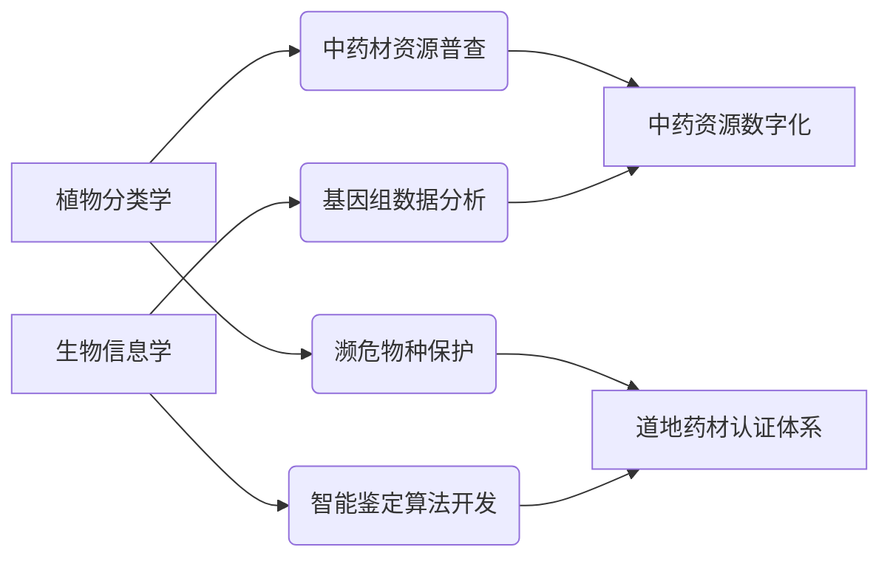

## 一、核心就业方向分析
### 1. 科研创新领域
- **药用植物基因组研究**：在科研院所开展中药资源基因组测序与功能解析，结合植物分类学构建道地药材遗传图谱
- **中药数字化平台开发**：参与中药资源数据库建设，开发物种智能鉴定系统

### 2. 制药产业方向
- **智能中药研发**：
  - 运用生物信息学进行活性成分虚拟筛选
  - 开发植物代谢组学数据分析工具
  - 优化药材基源鉴定流程（需植物分类学知识）
- **药品质量控制**：建立中药指纹图谱智能分析系统

### 3. 检测认证机构
- **第三方生物检测**：
  - 药用植物DNA测序数据分析
  - 开发中药材溯源技术
- **标准化制定**：参与中药鉴定行业标准制定

## 二、交叉领域发展机遇

## 三、竞争力提升策略

1. **技术能力拓展** ：

* 掌握Python/R语言及生物信息学工具链
* 学习AI辅助药物发现技术

1. **资质认证建议** ：

* 考取执业药师资格
* 获取GLP/GCP认证

1. **实践方向选择** ：

* 参与组学数据库建设项目
* 开发药用植物分类算法模型

## 四、薪酬参考（2025年数据）

| 岗位类型     | 初级(0-2年) | 中级(3-5年)        |
| ------------ | ----------- | ------------------ |
| 科研机构     | 6-9k/月     | 10-15k/月+项目奖励 |
| 药企研发岗   | 8-12k/月    | 15-25k/月          |
| 检测服务机构 | 7-10k/月    | 12-18k/月+绩效     |

## 五、决策路径建议

1. **科研倾向** ：

* 选择高校/研究所（建议继续深造）
* 参与国家重点研发计划项目

1. **产业倾向** ：

* 技术研发→选择药企生物信息部
* 应用服务→检测机构技术顾问

1. **新兴领域** ：

* 中药材区块链溯源系统开发
* 濒危药用植物基因库建设
